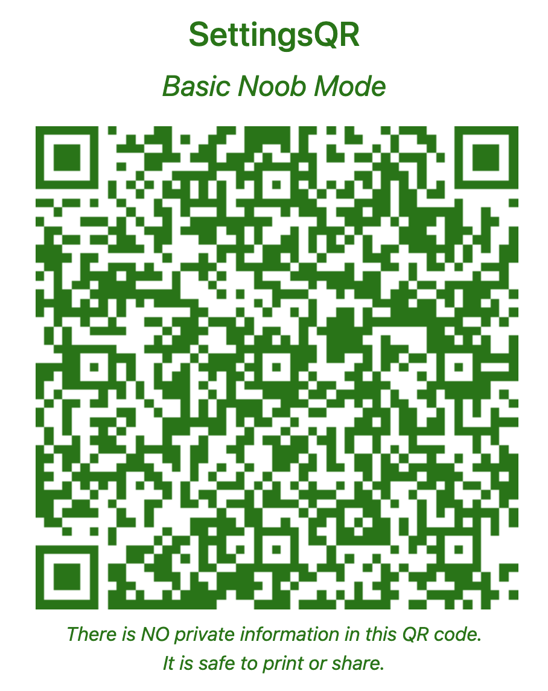
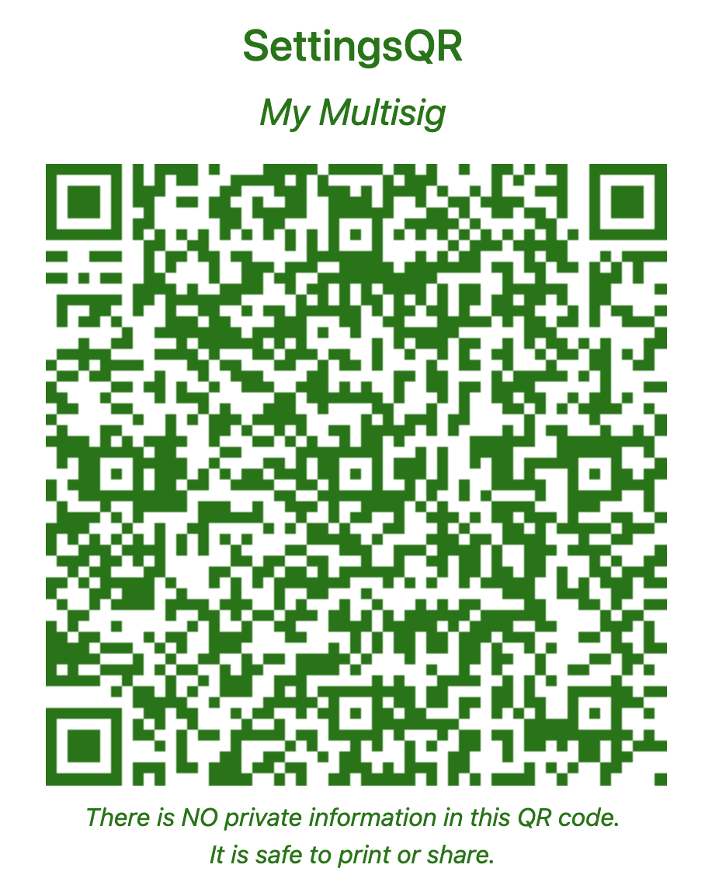

# SettingsQR Specification

SettingsQRs are a way to encode the settings options for the SeedSigner into a QR code. This allows users to easily load the settings into their SeedSigner without having to manually enter them one-by-one.

Because SettingsQRs only store settings options, they are safe to share publicly. They do not contain any sensitive information like seeds or xpubs.

Some basic use cases:
* An instructor has a class of bitcoin beginners and has them start by scanning a SettingsQR that disables all advanced settings. The next class is an advanced group that uses the same devices, so they begin by scanning a different SettingsQR that's customized for their session's more advanced topic.
* Customer support for a company offering collaborative custody begins each support call by having the customer load the company's preferred multisig-only settings.


## Data Format
The data in a SettingsQR is just a series of `key=value` pairs, separated by whitespace (spaces or line breaks).

Each SettingsQR begins with:

```
settings::v1
```

This signals to SeedSigner that this is a SettingsQR to differentiate it from the variety of other QR codes that the SeedSigner can parse.

_(there is only one version of the SettingsQR format at this time)_

The `key=value` pairs then follow:

```
settings::v1
persistent=D
coords=bw,nun,spa,spd
denom=thr
network=M
...
```

The SettingsQR Generator uses spaces instead of line breaks, but the end result is the same.

```
settings::v1 persistent=D coords=bw,nun,spa,spd denom=thr network=M ...
```

The `key` names are taken from the SeedSigner `SettingsDefinition`, where each setting is described in a `SettingsEntry`. SettingsQRs should use the `abbreviated_name` (e.g. "coords") if it exists in the `SettingsEntry`, otherwise use the `attr_name` (e.g. "coordinators").

The `value` options are pulled from the `SettingsEntry`'s `selection_options` list. Settings that allow for multiple selections should be comma-separated in the SettingsQR `value` (e.g. "bw,nun,spa,spd" for the "coords" setting).


## Optional SettingsQR `name`
A SettingsQR may specify a `name` for itself as its first `key=value` pair:

```
settings::v1
name=Keith's_basic_settings
persistent=D
coords=bw,nun,spa,spd
denom=thr
network=M
...
```

The `name` cannot include any whitespace or the `=` character. SeedSigner will display the `name` on the SettingsQR screen when the user scans the SettingsQR to help the user identify which settings they just loaded.

SeedSigner will replace underscores ("_") with spaces when displaying the `name`.


## SeedSigner parsing behavior
### Missing values
If a key is missing from the SettingsQR, SeedSigner will use the default value for that `SettingsEntry`.

The only exception to this is for hidden settings (e.g. `qr_brightness`); if a value is already specified in the user's current settings, SeedSigner will preserve that value.


### Unrecognized keys
SeedSigner will ignore any key entries that don't correspond to a `SettingsEntry`.


## Unrecognized values
SeedSigner will raise an `Exception` if it encounters a value that is not in the `selection_options` list for that `SettingsEntry`.


## Examples
SettingsQR configured for limited options for a beginner:



---
SettingsQR configured for an advanced multisig user:


